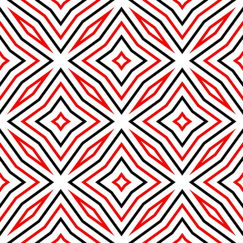

# Alt Text

# Learning Objectives
Through this page, you will learn how to: 
  - Describe what **Alt Text** is.
  - Write effective **Alt Texts**.

What is Alt Text?
===

**Alternative (Alt) Text** is a brief, descriptive text that provides an alternative to visual content.

Here is a real-world example in which you could use alt text: 

You have a visually impaired student who relies on a screen reader to access content. If you include an image in your course slides, the screen reader will attempt to read the Alt Text associated with the image. Without helpful Alt Text, the student won't be able to understand the content as fully as sighted students.

By incorporating Alt Text, instructors can create more accessible, inclusive, and effective learning experiences for all students.

> #### What is Screen Reader?
> A screen reader is a type of assistive technology that reads aloud the text and descriptions of images that are displayed on a computer screen.  They are essential for blind or visually impaired people to access and interact with computers and digital content.

Writing Effective Alt Texts
===

Then, how can we write a good Alt Text? 

Consider these guidelines:
- **Brevity is Key**
    - Aim for 1-2 sentences.
- **Highlight Essential Details**
    - Describe critical aspects of the image, such as the environment, actions, interactions, and facial expressions.
- **Avoid Redundant Phrases**
    - Refrain from starting with "an image of" or "a picture of."
- **Specify the Type**
    - Mention if the image is a logo, painting, cartoon, diagram, or chart.
- **For Decorative Images**
    - If the image is purely decorative (e.g., stylistic borders), mark it as "decorative" or leave the alt attribute empty.

Here are some examples.

**Alt text:**
"A student is sitting at a classroom table, holding a pen with a thick book and a notebook in front of him. About ten other students are sitting at their desks, listening to the instructor at the front of the room."

**Alt text:**  
"Multiple rows of sunflowers in a large field."

 

**Alt text:**  
"Decorative."

> Additional Resources for Writing Effective Alt Text
>> - [Havard Digital Accessibility](https://accessibility.huit.harvard.edu/describe-content-images)
>> - [University of South Carolina Digital Accessibility](https://sc.edu/about/offices_and_divisions/digital-accessibility/toolbox/best_practices/alternative_text/step-by-step-instructions-alt-text/index.php)
>> - [Indiana University University Information Technology Services](https://kb.iu.edu/d/arwg)  

